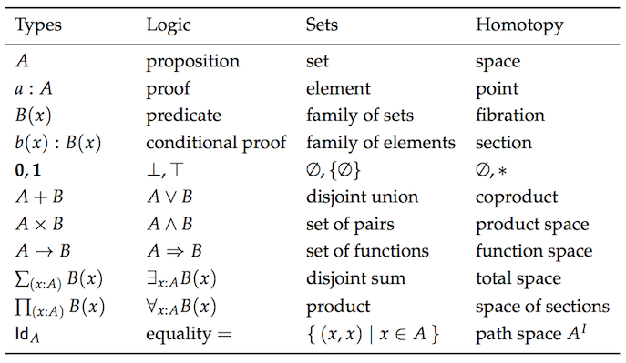
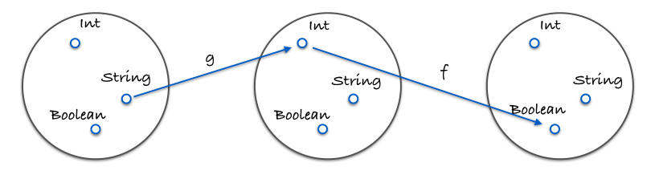

# Capitolo 5: Coding usando la composizione

## Allevamento funzionale

Ed ecco `compose`:

```js
const compose = (...fns) => (...args) => fns.reduceRight((res, fn) => [fn.call(null, ...res)], args)[0];
```

... Non aver paura! Questa è la forma super Saiyan di livello 9000 di _compose_. Per motivi di ragionamento, abbandoniamo l'implementazione variadica e consideriamo una forma più semplice per comporre due funzioni insieme. Una volta capito questo, puoi spingere ulteriormente l'astrazione e considerare che funziona semplicemente per un numero qualsiasi di funzioni (potremmo persino dimostrarlo)!

Ecco un _compose_ più semplice per voi miei cari lettori:

```js
const compose2 = (f, g) => x => f(g(x));
```

`f` e `g` sono funzioni e `x` è il valore "convogliato" attraverso di esse.

La composizione sembra un allevamento funzionale. Tu, allevatore di funzioni, selezionane due con i tratti che desideri combinare e uniscile insieme per generarne una nuova di zecca. L'utilizzo è il seguente:

```js
const toUpperCase = x => x.toUpperCase();
const exclaim = x => `${x}!`;
const shout = compose(exclaim, toUpperCase);

shout('send in the clowns'); // "SEND IN THE CLOWNS!"
```

La composizione di due funzioni restituisce una nuova funzione. Ciò ha perfettamente senso: la composizione di due unità di un certo tipo (in questo caso funzione) dovrebbe produrre una nuova unità di quel tipo. Non colleghi due Lego insieme e ottieni un registro Lincoln. C'è una teoria qui, una legge sottostante che scopriremo a tempo debito.

Nella nostra definizione di "compose", "g" verrà eseguito prima della "f", creando un flusso di dati da destra a sinistra. Questo è molto più leggibile che annidare un mucchio di chiamate di funzione. Senza comporre, quanto sopra diverrebbe:

```js
const urla = x => esclama(toUpperCase(x));
```

Invece che dall'interno all'esterno, percorriamo da destra a sinistra, il che suppongo sia un passo nella direzione sinistra (boo!). Diamo un'occhiata a un esempio in cui la sequenza conta:

```js
const head = x => x[0];
const reverse = reduce((acc, x) => [x, ...acc], []);
const last = compose(head, reverse);

last(['jumpkick', 'roundhouse', 'uppercut']); // 'uppercut'
```

`reverse` inverte la lista mentre `head` prende l'elemento iniziale. Ciò si traduce in una funzione "last" efficace, anche se inefficiente. Qui la sequenza delle funzioni nella composizione dovrebbe essere evidente. Potremmo definire una versione da sinistra a destra, tuttavia, rispecchiamo la versione matematica. Esatto, applichiamo la composizione come si trova nei libri di matematica. In effetti, forse è il momento di guardare una proprietà che vale per qualsiasi composizione.

```js
// proprietà associativa
compose(f, compose(g, h)) === compose(compose(f, g), h);
```

La composizione rispetta la proprietà associativa, il che significa che non importa come ne raggruppate due. Quindi, se dovessimo scegliere di scrivere in maiuscolo, possiamo scrivere:

```js
compose(toUpperCase, compose(head, reverse));
// oppure
compose(compose(toUpperCase, head), reverse);
```

Dal momento che non importa come raggruppiamo le nostre chiamate a "compose", il risultato sarà lo stesso. Questo ci permette di scrivere una composizione variadica e di usarla come segue:

```js
// in precedenza avremmo dovuto scrivere due composizioni, ma poiché è associativa,
// possiamo dare a compose quante fn vogliamo e lasciare che decida come raggrupparle.
const arg = ['jumpkick', 'roundhouse', 'uppercut'];
const lastUpper = compose(toUpperCase, head, reverse);
const loudLastUpper = compose(exclaim, toUpperCase, head, reverse);

lastUpper(arg); // 'UPPERCUT'
loudLastUpper(arg); // 'UPPERCUT!'
```

L'applicazione della proprietà associativa ci dà questa flessibilità e tranquillità che il risultato sarà equivalente. La definizione variadica leggermente più complicata è inclusa nelle librerie di supporto per questo libro ed è la definizione normale che troverai in biblioteche come [lodash] [lodash-website], [underscore] [underscore-website] e [ramda] [ramda-website].

Un piacevole vantaggio dell'associatività è che qualsiasi gruppo di funzioni può essere estratto e raggruppato nella propria composizione. Giochiamo con il refactoring del nostro esempio precedente:

```js
const loudLastUpper = compose(exclaim, toUpperCase, head, reverse);

// -- oppure ---------------------------------------------------------------

const last = compose(head, reverse);
const loudLastUpper = compose(exclaim, toUpperCase, last);

// -- oppure ---------------------------------------------------------------

const last = compose(head, reverse);
const angry = compose(exclaim, toUpperCase);
const loudLastUpper = compose(angry, last);

// altre variazioni...
```

Non ci sono risposte giuste o sbagliate: stiamo solo collegando i nostri Lego in qualsiasi modo ci piaccia. Di solito è meglio raggruppare le cose in modo riutilizzabile come "last" e "angry". Se si ha familiarità con il "[Refactoring] [refactoring-book]" di Fowler, si potrebbe riconoscere questo processo come "[funzione di estrazione][extract-function-refactor]" ... tranne che senza tutto lo stato dell'oggetto di cui preoccuparsi.

## Pointfree

Uno stile pointfree significa non dover mai comunicare i tuoi dati. Mi scusi. Significa funzioni che non menzionano mai i dati su cui operano. Le funzioni di prima classe, il curry e la composizione giocano bene insieme per creare questo stile.

> Hint: Versioni di `replace` & `toLowerCase` sono definite su [Appendix C - Pointfree Utilities](./appendix_c.md). Non esitate a dare un'occhiata!

```js
// non pointfree perché citiamo i dati: word
const snakeCase = word => word.toLowerCase().replace(/\s+/ig, '_');

// pointfree
const snakeCase = compose(replace(/\s+/ig, '_'), toLowerCase);
```

Vedi come abbiamo applicato parzialmente "replace"? Quello che stiamo facendo è passare i nostri dati attraverso ogni funzione da 1 argomento. Il currying ci consente di preparare ogni funzione a prendere i suoi dati, operarli e passarli. Un'altra cosa da notare è come non abbiamo bisogno dei dati per costruire la nostra funzione nella versione pointfree, mentre in quella puntuale, dobbiamo avere la nostra `word` disponibile prima di ogni altra cosa.

Diamo un'occhiata a un altro esempio.

```js
// Nella versione non poitfree noi menzioniamo name
const initials = name => name.split(' ').map(compose(toUpperCase, head)).join('. ');

// pointfree
// NOTE: usiamo 'intercalate' dall'appendice invece di 'join' che verrà introdotto nel Capitolo 09!
const initials = compose(intercalate('. '), map(compose(toUpperCase, head)), split(' '));

initials('hunter stockton thompson'); // 'H. S. T'
```

Il codice pointfree può aiutarci a rimuovere i nomi inutili e mantenerci concisi e generici. Pointfree è una buona cartina di tornasole per il codice funzionale in quanto ci fa sapere che abbiamo piccole funzioni che prendono l'input per l'output. Non si può comporre un ciclo while, per esempio. Attenzione, tuttavia, il pointfree è un'arma a doppio taglio e talvolta può offuscare l'intenzione. Non tutto il codice funzionale è privo di punti e questo è O.K. Cercheremo di farlo dove possiamo e altrimenti manterremo le normali funzioni.

## Debugging
Un errore comune è comporre qualcosa come "map", una funzione di due argomenti, senza prima applicarlo parzialmente.

```js
// sbagliato - finiamo per dare ad angry un array e abbiamo applicato parzialmente la map con chissà cosa. 
const latin = compose(map, angry, reverse);

latin(['frog', 'eyes']); // error

// giusto - ogni funziona prende esattamente un argomento.
const latin = compose(map(angry), reverse);

latin(['frog', 'eyes']); // ['EYES!', 'FROG!'])
```

Se hai problemi a eseguire il debug di una composizione, possiamo usare questa utile, ma impura funzione di traccia per vedere cosa sta succedendo.

```js
const trace = curry((tag, x) => {
  console.log(tag, x);
  return x;
});

const dasherize = compose(
  intercalate('-'),
  toLower,
  split(' '),
  replace(/\s{2,}/ig, ' '),
);

dasherize('The world is a vampire');
// TypeError: Cannot read property 'apply' of undefined
```

Qualcosa non va qui, cerchiamo di `trace`

```js
const dasherize = compose(
  intercalate('-'),
  toLower,
  trace('after split'),
  split(' '),
  replace(/\s{2,}/ig, ' '),
);

dasherize('The world is a vampire');
// dopo lo split otteniamo [ 'The', 'world', 'is', 'a', 'vampire' ]
```

Ah! Abbiamo bisogno di `map` ` toLower` dato che sta lavorando su un array.

```js
const dasherize = compose(
  intercalate('-'),
  map(toLower),
  split(' '),
  replace(/\s{2,}/ig, ' '),
);

dasherize('The world is a vampire'); // 'the-world-is-a-vampire'
```

La funzione `trace` ci permette di visualizzare i dati a un certo punto per scopi di debug. Linguaggi come Haskell e PureScript hanno funzioni simili per facilitarne lo sviluppo.

La composizione sarà il nostro strumento per costruire programmi e, per fortuna, è supportata da una potente teoria che garantisce che le cose funzionino per noi. Esaminiamo questa teoria.

## Teoria delle categorie

La teoria delle categorie è una branca astratta della matematica che può formalizzare concetti di diversi rami come la teoria degli insiemi, la teoria dei tipi, la teoria dei gruppi, la logica e altro ancora. Si occupa principalmente di oggetti, morfismi e trasformazioni, che rispecchiano abbastanza da vicino la programmazione. Ecco un grafico degli stessi concetti visti da ciascuna teoria separata.



Scusa, non volevo spaventarti. Non mi aspetto che tu abbia familiarità con tutti questi concetti. Il mio scopo è mostrarti quanta duplicazione abbiamo in modo che tu possa capire perché la teoria delle categorie mira a unificare queste cose.

Nella teoria delle categorie, abbiamo qualcosa chiamato... una categoria. È definito come una collezione con i seguenti componenti:

  * Una raccolta di oggetti
  * Una raccolta di morfismi
  * Una nozione di composizione sui morfismi
  * Un morfismo distinto chiamato identità

La teoria delle categorie è abbastanza astratta da modellare molte cose, ma applichiamo questo a tipi e funzioni, che è ciò che ci interessa al momento.

**Una collezione di oggetti**
Gli oggetti saranno tipi di dati. Ad esempio, `String`, `Boolean`, `Number`, `Object`, ecc. Spesso vediamo i tipi di dati come insiemi di tutti i valori possibili. Si potrebbe considerare `Boolean` come l'insieme di `[true, false]` e `Number` come l'insieme di tutti i possibili valori numerici. Trattare i tipi come insiemi è utile perché possiamo usare la teoria degli insiemi per lavorarci

Ecco un'immagine che dimostra la composizione:




Qui il codice concreto:

```js
const g = x => x.length;
const f = x => x === 4;
const eUnaLetteraDiQuattroCaratteri = compose(f, g);
```

**Un morfismo distinto chiamato identità**
Introduciamo una funzione utile chiamata `id`. Questa funzione prende semplicemente un input e te lo risputa. Guarda:

```js
const id = x => x;
```
Potresti chiederti "Per cosa diavolo è utile?". Faremo un uso estensivo di questa funzione nei capitoli seguenti, ma per ora pensatela come una funzione che può sostituire il nostro valore - una funzione mascherata da dati.

`id` deve giocare bene con la composizione. Ecco una proprietà che vale sempre per ogni funzione f unaria (unaria: una funzione con un argomento):

```js
// identity
compose(id, f) === compose(f, id) === f;
// true
```

Ehi, è proprio come la proprietà dell'identità sui numeri! Se non è immediatamente chiaro, dedica un po 'di tempo. Comprendi la futilità. Presto vedremo "id" utilizzato ovunque, ma per ora vediamo che è una funzione che funge da sostituto per un dato valore. Questo è molto utile quando si scrive codice pointfree.

Quindi il gioco è fatto, una categoria di tipi e funzioni. Se questa è la tua prima introduzione, immagino che tu sia ancora un po 'confuso su cosa sia una categoria e perché sia ​​utile. Baseremo su questa conoscenza in tutto il libro. A partire da ora, in questo capitolo, su questa linea, puoi almeno vedere che ci fornisce un po' di saggezza riguardo alla composizione - vale a dire, l'associatività e le proprietà dell'identità.

Quali sono alcune altre categorie, chiedi? Bene, possiamo definirne una per i grafi orientati con i nodi che sono oggetti, gli archi sono morfismi e la composizione è solo la concatenazione del percorso. Possiamo definire con Numbers come oggetti e `>=` come morfismi (in realtà qualsiasi ordine parziale o totale può essere una categoria). Ci sono un sacco di categorie, ma per gli scopi di questo libro, ci occuperemo solo di quella definita sopra. Abbiamo sufficientemente affrontato la superficie e dobbiamo andare avanti.

## In Breve

La composizione collega le nostre funzioni insieme come una serie di tubi. I dati fluiranno attraverso la nostra applicazione come devono: dopo tutto le funzioni pure sono il percorso tra input e output, quindi rompere questa catena bloccherebbe l'output, rendendo il nostro software inutile.

Consideriamo la composizione un principio di progettazione al di sopra di tutti gli altri. Questo perché mantiene la nostra app semplice e ragionevole. La teoria delle categorie giocherà un ruolo importante nell'architettura delle app, modellando gli effetti collaterali (side effects) e garantendo la correttezza.

Ora siamo a un punto in cui ci sarebbe utile fare un po' di pratica. Facciamo un'applicazione di esempio.


[Capitolo 06: Applicazione di esempio](ch06-it.md)

## Esercizi

In ogni esercizio successivo, prenderemo in considerazione oggetti Car con la seguente forma:

```js
{
  name: 'Aston Martin One-77',
  horsepower: 750,
  dollar_value: 1850000,
  in_stock: true,
}
```


  
Usa `compose()` per riscrivere la funzione seguente.  
  
  
```js  
const isLastInStock = (cars) => {  
  const lastCar = last(cars);  
  return prop('in_stock', lastCar);  
};  
```  
  
  
  
  
  


---


Considerando la seguente funzione:

```js
const average = xs => reduce(add, 0, xs) / xs.length;
```

  
Utilizzare la funzione di supporto `average` per effettuare il refactoring di `averageDollarValue` come composizione.

  
```js  
const averageDollarValue = (cars) => {  
  const dollarValues = map(c => c.dollar_value, cars);  
  return average(dollarValues);  
};  
```  
  
  
  
  
  


---



Rifattorizza `fastestCar` usando `compose()` e altre funzioni in stile pointfree. Suggerimento, la funzione ʻappend` può tornare utile.
  
  
```js  
const fastestCar = (cars) => {  
  const sorted = sortBy(car => car.horsepower);  
  const fastest = last(sorted);  
  return concat(fastest.name, ' is the fastest');  
};  
```  
  
  
  
  
  

[lodash-website]: https://lodash.com/
[underscore-website]: https://underscorejs.org/
[ramda-website]: https://ramdajs.com/
[refactoring-book]: https://martinfowler.com/books/refactoring.html
[extract-function-refactor]: https://refactoring.com/catalog/extractFunction.html