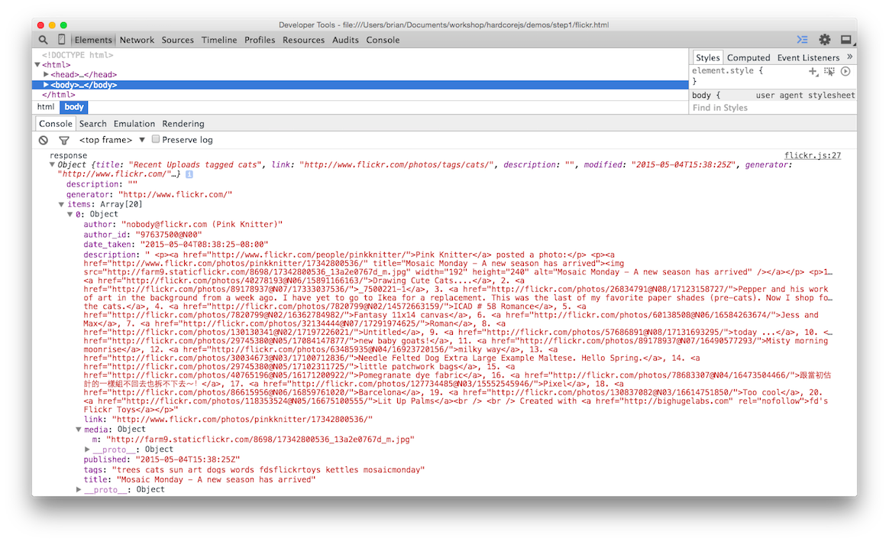

# Capitolo 6: Applicazione di esempio

## Codice dichiarativo

Stiamo per cambiare la nostra mentalità. Da qui in avanti, smetteremo di dire al computer come svolgere il suo lavoro e scriveremo invece una specifica di ciò che vorremmo come risultato. Sono sicuro che lo troverai molto meno stressante che cercare di microgestire tutto tutto il tempo.

Dichiarativo, al contrario di imperativo, significa che scriveremo espressioni, al contrario di istruzioni passo passo.

Pensa a SQL. Non c'è "prima fai questo, poi fallo". C'è un'espressione che specifica cosa desideriamo dal database. Non decidiamo come fare il lavoro, lo fa. Quando il database viene aggiornato e il motore SQL ottimizzato, non è necessario modificare la nostra query. Questo perché ci sono molti modi per interpretare le nostre specifiche e ottenere lo stesso risultato.

Per alcune persone, me compreso, all'inizio è difficile afferrare il concetto di codifica dichiarativa, quindi indichiamo alcuni esempi per avere un'idea.

```js
// imperativa
const makes = [];
for (let i = 0; i < cars.length; i += 1) {
  makes.push(cars[i].make);
}

// dichiarativa
const makes = cars.map(car => car.make);
```

Il ciclo imperativo deve prima istanziare l'array. L'interprete deve valutare questa asserzione prima di proseguire. Quindi itera direttamente l'elenco delle auto, aumentando manualmente un contatore e mostrandoci i suoi pezzi attraverso una volgare iterazione esplicita.

La versione `map` è un'espressione. Non richiede alcun tipo di valutazione. C'è molta libertà qui per come la funzione map itera e come può essere assemblato l'array restituito. Specifica *cosa*, non *come*. Quindi è dichiarativa.

Oltre ad essere più chiara e concisa, la funzione che usa la map può essere ottimizzata a piacimento e il nostro prezioso codice applicativo non deve cambiare.

Per quelli di voi che stanno pensando "Sì, ma è molto più veloce fare il ciclo imperativo", suggerisco di istruirvi su come il JIT ottimizza il vostro codice. Ecco un [video fantastico che potrebbe far luce](https://www.youtube.com/watch?v=g0ek4vV7nEA)


Ecco un altro esempio.

```js
// imperativo
const authenticate = (form) => {
  const user = toUser(form);
  return logIn(user);
};

// dichiarativo
const authenticate = compose(logIn, toUser);
```

Anche se non c'è nulla di necessariamente sbagliato nella versione imperativa, c'è ancora incorporata una valutazione passo passo. L'espressione `compose` afferma semplicemente un fatto: L'autenticazione è la composizione di `toUser` e `logIn`. Ancora una volta, questo lascia spazio per le modifiche al codice di supporto e fa sì che il nostro codice dell'applicazione sia una specifica di alto livello.

Nell'esempio sopra, l'ordine di valutazione è specificato (`toUser` deve essere chiamato prima di` logIn`), ma ci sono molti scenari in cui l'ordine non è importante, e questo è facilmente specificato con la codifica dichiarativa (ne parleremo più avanti) .

Poiché non dobbiamo codificare l'ordine di valutazione, la codifica dichiarativa si presta al calcolo parallelo. Questo accoppiato con le funzioni pure è il motivo per cui FP è una buona opzione per il futuro parallelo: non abbiamo davvero bisogno di fare nulla di speciale per ottenere sistemi paralleli / simultanei.

## Un flickr in functional programming

Costruiremo ora un'applicazione di esempio in modo dichiarativo e componibile. Per ora imbrogliamo ancora e utilizziamo gli effetti collaterali (side effects), ma li manterremo minimi e separati dalla nostra base di codice pura. Costruiremo un widget per il browser che scarica le immagini di flickr e le visualizza. Cominciamo con lo scaffolding dell'app. Ecco l'html:

```html
<!doctype html>
<html lang="en">
  <head>
    <meta charset="utf-8">
    <title>Flickr App</title>
  </head>
  <body>
    <main id="js-main" class="main"></main>
    <script src="https://cdnjs.cloudflare.com/ajax/libs/require.js/2.2.0/require.min.js"></script>
    <script src="main.js"></script>
  </body>
</html>
```

Ed ecco lo scheletro main.js:

```js
const CDN = s => `https://cdnjs.cloudflare.com/ajax/libs/${s}`;
const ramda = CDN('ramda/0.21.0/ramda.min');
const jquery = CDN('jquery/3.0.0-rc1/jquery.min');

requirejs.config({ paths: { ramda, jquery } });
requirejs(['jquery', 'ramda'], ($, { compose, curry, map, prop }) => {
  // inseriremo qui il codice della nostra app
});
```

Stiamo inserendo [ramda] (https://ramdajs.com) invece di lodash o qualche altra libreria di utilità. Include `compose`, `curry` e altro. Ho usato requirejs, che può sembrare eccessivo, ma lo useremo per tutto il libro e la coerenza è la chiave.

Ora guardando le specifiche la nostra app farà 4 cose.

1. Costruisce un URL per il nostro particolare termine di ricerca
2. Effettua la chiamata api di flickr
3. Trasforma il json risultante in immagini html
4. Posiziona sullo schermo le immagini html

Ci sono 2 azioni impure sopra menzionate. Li vedi? Quei bit su come ottenere dati dall'API di flickr e posizionarli sullo schermo. Definiamo prima quelle in modo da poterli mettere in quarantena. Inoltre, aggiungeremo la nostra simpatica funzione `trace` per un facile debugging.

```js
const Impure = {
  getJSON: curry((callback, url) => $.getJSON(url, callback)),
  setHtml: curry((sel, html) => $(sel).html(html)),
  trace: curry((tag, x) => { console.log(tag, x); return x; }),
};
```

Qui abbiamo semplicemente avvolto i metodi jQuery in modo che siano curried e abbiamo scambiato gli argomenti in una posizione più favorevole. Li abbiamo inseriti nel namespace `Impure` quindi sappiamo che si tratta di funzioni pericolose. In un esempio futuro, renderemo pure queste due funzioni`

Successivamente dobbiamo costruire un URL da passare alla nostra funzione `Impure.getJSON`.
`

```js
const host = 'api.flickr.com';
const path = '/services/feeds/photos_public.gne';
const query = t => `?tags=${t}&format=json&jsoncallback=?`;
const url = t => `https://${host}${path}${query(t)}`;
```

Ci sono modi fantasiosi ed eccessivamente complessi per scrivere `url` pointfree usando monoidi (ne parleremo più avanti) o combinatori. Abbiamo scelto di utilizzare una versione leggibile e di assemblare questa stringa nel normale modo pointful.

Scriviamo una funzione app che effettui la chiamata e posizioni i contenuti sullo schermo.

```js
const app = compose(Impure.getJSON(Impure.trace('response')), url);
app('cats');
```

Questo chiama la nostra funzione  `url`, quindi passa la stringa alla nostra funzione `getJSON`, che è stata parzialmente applicata con `trace`. Il caricamento dell'app mostrerà la risposta dalla chiamata api nella console.



Vorremmo creare immagini da questo json. Sembra che i `mediaUrls` siano sepolti in `items`, quindi dentro la proprietà `m` di ogni `media`.

Comunque, per arrivare a queste proprietà annidate possiamo usare una bella funzione getter universale da ramda chiamata `prop`. Ecco una versione casalinga in modo da poter vedere cosa sta succedendo:

```js
const prop = curry((property, object) => object[property]);
```

In realtà è abbastanza noioso. Usiamo semplicemente la sintassi "[]" per accedere a una proprietà su qualsiasi oggetto. Usiamolo per arrivare al nostro `mediaUrls`.

```js
const mediaUrl = compose(prop('m'), prop('media'));
const mediaUrls = compose(map(mediaUrl), prop('items'));
```

Una volta raccolti gli `items`, dobbiamo `mapparli` per estrarre ogni URL multimediale. Ciò si traduce in un bel array di `mediaUrls`. Colleghiamo questo alla nostra app e stampiamoli sullo schermo.

```js
const render = compose(Impure.setHtml('#js-main'), mediaUrls);
const app = compose(Impure.getJSON(render), url);
```

Tutto quello che abbiamo fatto è creare una nuova composizione che chiamerà i nostri `mediaUrls` e impostare l'html` <main> `con loro. Abbiamo sostituito la chiamata a `trace` con` render` ora che abbiamo qualcosa da rendere oltre a raw json. Questo mostrerà grossolanamente i nostri `mediaUrls` all'interno del corpo.

Il nostro passo finale ` trasformare questi `mediaUrls` in autentiche `immagini`. In un'applicazione più grande, useremo una libreria template/dom come Handlebars o React. Per questa applicazione, però, abbiamo solo bisogno di un tag img, quindi rimaniamo con jQuery.

```js
const img = src => $('', { src });
```

Il metodo "html" di jQuery accetterà un array di tag. Dobbiamo solo trasformare i nostri mediaUrl in immagini e inviarli a `setHtml`.

```js
const images = compose(map(img), mediaUrls);
const render = compose(Impure.setHtml('#js-main'), images);
const app = compose(Impure.getJSON(render), url);
```

E abbiamo finito!


Ecco lo script finito:
[include](./exercises/ch06/main.js)

Ora guarda qui. Una descrizione meravigliosamente dichiarativa di ciò che sono le cose, non di come sono diventate. Vediamo ora ogni riga come un'equazione con proprietà valide. Possiamo usare queste proprietà per ragionare sulla nostra applicazione e refactoring.

## Un refactoring iniziale

È disponibile un'ottimizzazione: mappiamo ogni elemento per trasformarlo in un URL multimediale, quindi mappiamo di nuovo quei mediaUrl per trasformarli in tag img. Esiste una legge in materia di mappa e composizione:

```js
// map's composition law
compose(map(f), map(g)) === map(compose(f, g));
```

Possiamo usare questa proprietà per ottimizzare il nostro codice. Facciamo un refactoring di principio.

```js
// codice originale
const mediaUrl = compose(prop('m'), prop('media'));
const mediaUrls = compose(map(mediaUrl), prop('items'));
const images = compose(map(img), mediaUrls);
```

Allineamo i nostri map. Possiamo rendere inline la chiamata a `mediaUrls` in `images` grazie al ragionamento equazionale e alla purezza.

```js
const mediaUrl = compose(prop('m'), prop('media'));
const images = compose(map(img), map(mediaUrl), prop('items'));
```

Ora che abbiamo allineato la nostra `map` possiamo applicare la legge sulla composizione.

```js
/*
compose(map(f), map(g)) === map(compose(f, g));
compose(map(img), map(mediaUrl)) === map(compose(img, mediaUrl));
*/

const mediaUrl = compose(prop('m'), prop('media'));
const images = compose(map(compose(img, mediaUrl)), prop('items'));
```

Ora il bugger eseguirà un loop solo una volta mentre trasforma ogni elemento in un'immagine. Rendiamolo un po 'più leggibile estraendo la funzione.

```js
const mediaUrl = compose(prop('m'), prop('media'));
const mediaToImg = compose(img, mediaUrl);
const images = compose(map(mediaToImg), prop('items'));
```

## In Breve

Abbiamo visto come mettere in pratica le nostre nuove abilità con un'app piccola ma reale. Abbiamo usato il nostro framework matematico per ragionare e refactoring del nostro codice. Ma per quanto riguarda la gestione degli errori e la ramificazione del codice? Come possiamo rendere pura l'intera applicazione invece di limitarci a dare spazio alle funzioni distruttive? Come possiamo rendere la nostra app più sicura ed espressiva? Queste sono le domande che affronteremo nella parte 2.

[Capitolo 7: Hindley-Milner e Me](ch07-it.md)